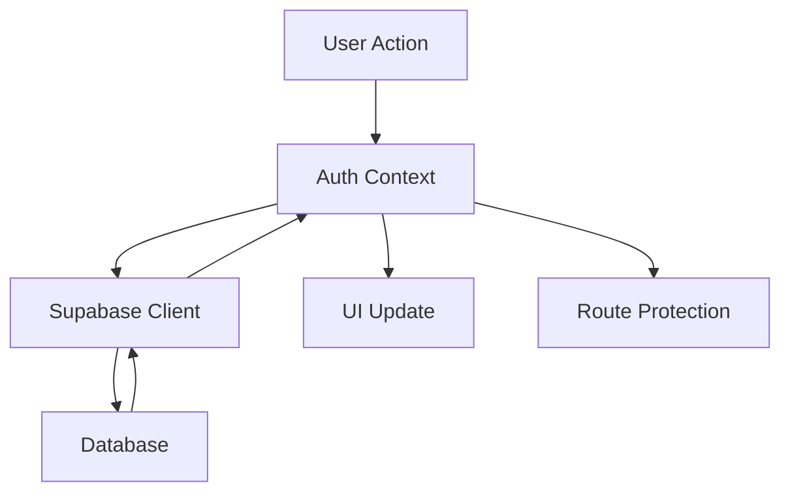

# WarpDrive Authentication Implementation Documentation

## Overview

This document details the complete implementation of Supabase authentication for the WarpDrive business process management application. The implementation provides secure user authentication, registration, password management, and user profile handling.

## Table of Contents

1. [Architecture Overview](#architecture-overview)
2. [File Structure](#file-structure)
3. [Setup Instructions](#setup-instructions)
4. [Database Schema](#database-schema)
5. [Authentication Flow](#authentication-flow)
6. [API Reference](#api-reference)
7. [Security Features](#security-features)
8. [Development Guidelines](#development-guidelines)
9. [Troubleshooting](#troubleshooting)
10. [Future Considerations](#future-considerations)

## Architecture Overview

### Core Components

The authentication system is built around four main components:

1. **Supabase Client** (`lib/supabase.ts`) - Core database and auth client
2. **Authentication Context** (`contexts/auth-context.tsx`) - Global auth state management
3. **Route Protection** (`components/auth-guard.tsx`) - Access control system
4. **User Interface** (`app/signin`, `app/signup`, `app/forgot-password`) - Authentication pages

### State Management Flow



### Technology Stack

- **Authentication**: Supabase Auth with PKCE flow
- **State Management**: React Context with TypeScript
- **Database**: PostgreSQL with Row Level Security
- **UI Framework**: Next.js 14 App Router + shadcn/ui
- **Validation**: Zod-like validation with TypeScript

## File Structure

```
├── lib/
│   └── supabase.ts                 # Supabase client configuration
├── types/
│   └── auth.ts                     # TypeScript interfaces
├── contexts/
│   └── auth-context.tsx            # Authentication state management
├── components/
│   ├── auth-guard.tsx              # Route protection
│   └── ui/
│       └── alert.tsx               # UI alert component
├── app/
│   ├── layout.tsx                  # Updated with AuthProvider
│   ├── page.tsx                    # Root routing logic
│   ├── signin/page.tsx             # Sign-in interface
│   ├── signup/page.tsx             # User registration
│   ├── forgot-password/page.tsx    # Password reset
│   └── organizations/page.tsx      # Protected main dashboard
├── docs/
│   └── auth-implementation.md      # This documentation
└── database/
    └── supabase-schema.sql         # Database schema
```

## Setup Instructions

### Prerequisites

1. **Supabase Project**: Active Supabase project with configured environment variables
2. **Environment Variables**: Already configured in `.env.local`
3. **Dependencies**: Supabase packages already installed

### Database Setup

1. **Execute Schema**: Run the provided SQL schema in Supabase SQL Editor:
   ```bash
   # Copy content from database/supabase-schema.sql and execute in Supabase dashboard
   ```

2. **Verify Setup**: Check that the following were created:
   - `profiles` table with proper columns
   - RLS policies for security
   - Triggers for automatic profile creation
   - Helper functions for profile management

### Application Integration

The authentication system is automatically integrated when the application runs. Key integration points:

1. **Layout Integration**: `AuthProvider` wraps the entire application in `app/layout.tsx`
2. **Route Protection**: Pages use `AuthGuard` for access control
3. **State Access**: Components use `useAuth()` hook for authentication state

### Testing the Setup

1. **Start Development Server**:
   ```bash
   npm run dev
   ```

2. **Test Authentication Flow**:
   - Navigate to `http://localhost:3000`
   - Should redirect to `/signin` for unauthenticated users
   - Sign up with new credentials
   - Verify email and sign in
   - Should redirect to `/organizations` with empty state

## Database Schema

### Tables

#### `profiles` Table
```sql
CREATE TABLE profiles (
    id UUID REFERENCES auth.users PRIMARY KEY,
    full_name TEXT NOT NULL,
    email TEXT NOT NULL UNIQUE,
    created_at TIMESTAMP WITH TIME ZONE DEFAULT NOW(),
    updated_at TIMESTAMP WITH TIME ZONE DEFAULT NOW()
);
```

### Security Policies

All policies ensure users can only access their own data:

```sql
-- Users can read their own profile
CREATE POLICY "Users can read own profile" ON profiles FOR SELECT USING (auth.uid() = id);

-- Users can update their own profile  
CREATE POLICY "Users can update own profile" ON profiles FOR UPDATE USING (auth.uid() = id);
```

### Automatic Profile Creation

Profiles are created automatically when users sign up through a database trigger:

```sql
CREATE OR REPLACE FUNCTION handle_new_user() 
RETURNS TRIGGER AS $$
BEGIN
    INSERT INTO profiles (id, full_name, email)
    VALUES (NEW.id, NEW.raw_user_meta_data->>'full_name', NEW.email);
    RETURN NEW;
END;
$$ LANGUAGE plpgsql SECURITY DEFINER;
```

## Authentication Flow

### User Registration Flow

1. User fills signup form with full name, email, password
2. `signUp()` function calls Supabase with metadata
3. Supabase creates user in `auth.users`
4. Database trigger automatically creates profile in `profiles` table
5. Email verification sent to user
6. User confirms email and can sign in

### Sign-In Flow

1. User enters email and password
2. `signIn()` function authenticates with Supabase
3. Session created and stored in localStorage
4. User profile loaded from `profiles` table
5. Redirect to `/organizations` page

### Route Protection Flow

1. `AuthGuard` component checks authentication status
2. Shows loading state during auth check
3. Redirects unauthenticated users to `/signin`
4. Renders protected content for authenticated users

### Session Management

- **Persistence**: Sessions stored in localStorage with `persistSession: true`
- **Refresh**: Automatic token refresh handled by Supabase with `autoRefreshToken: true`
- **Flow Type**: PKCE flow for enhanced security (`flowType: 'pkce'`)
- **Cross-tab**: Session sharing across browser tabs
- **Page Reload**: Robust session recovery via `INITIAL_SESSION` and `SIGNED_IN` event handling

## API Reference

### useAuth() Hook

```typescript
const {
  user,              // Current user from Supabase
  profile,           // User profile from profiles table
  session,           // Current session
  loading,           // Loading state
  isAuthenticated,   // Boolean auth status
  signIn,            // Sign in function
  signUp,            // Sign up function
  signOut,           // Sign out function
  resetPassword,     // Password reset function
} = useAuth()
```

### Authentication Functions

#### signIn(email, password)
```typescript
await signIn('user@example.com', 'password123')
```

#### signUp(email, password, fullName)
```typescript
await signUp('user@example.com', 'password123', 'John Doe')
```

#### signOut()
```typescript
await signOut()
```

#### resetPassword(email)
```typescript
await resetPassword('user@example.com')
```

### AuthGuard Component

```typescript
// Protect entire pages
<AuthGuard>
  <ProtectedContent />
</AuthGuard>

// With custom redirect
<AuthGuard redirectTo="/custom-signin">
  <ProtectedContent />
</AuthGuard>

// Guest-only pages
<GuestGuard redirectTo="/dashboard">
  <SignInForm />
</GuestGuard>
```

## Security Features

### Password Requirements
- Minimum 8 characters
- Validated on both client and server
- Hashed using bcrypt (handled by Supabase)

### Session Security
- PKCE authentication flow
- JWT tokens with configurable expiration
- Secure httpOnly cookies (when configured)
- XSS protection through proper token handling

### Row Level Security (RLS)
- All profile data protected by RLS policies
- Users can only access their own data
- Automatic policy enforcement at database level

### Data Validation
- Email format validation
- Password strength requirements
- Full name length constraints
- TypeScript type safety throughout

## Development Guidelines

### Adding Protected Routes

1. **Wrap with AuthGuard**:
   ```typescript
   export default function ProtectedPage() {
     return (
       <AuthGuard>
         <PageContent />
       </AuthGuard>
     )
   }
   ```

2. **Access User Data**:
   ```typescript
   function MyComponent() {
     const { user, profile } = useAuth()
     return <div>Hello {profile?.full_name}</div>
   }
   ```

### Error Handling

All authentication functions return proper error states:

```typescript
const handleSignIn = async () => {
  try {
    await signIn(email, password)
  } catch (error) {
    // Error is automatically displayed in UI
    console.error('Sign in failed:', error)
  }
}
```

### Adding OAuth Providers

The system supports OAuth through Supabase:

```typescript
await signInWithOAuth('google')  // Google OAuth
await signInWithOAuth('github')  // GitHub OAuth
```

## Troubleshooting

### Common Issues

#### 1. "User not found" error
- **Cause**: Email not registered or typo in email
- **Solution**: Check email spelling, ensure user is registered

#### 2. Profile not created
- **Cause**: Database trigger not working
- **Solution**: Verify trigger exists and is enabled in Supabase

#### 3. Redirect loops
- **Cause**: AuthGuard and GuestGuard conflict
- **Solution**: Check component wrapping and routing logic

#### 4. Session not persisting
- **Cause**: localStorage issues or domain mismatch
- **Solution**: Check browser storage, verify domain configuration

#### 5. **Authentication Timeout on Page Reload (RESOLVED)**
- **Issue**: Page reload would show infinite loading with "Authentication check timed out" errors
- **Root Cause**: Race conditions between `Promise.race()` timeouts and Supabase `getSession()` calls, plus blocking profile loading
- **Solution Implemented**: 
  - Removed `Promise.race()` timeout wrapper around `supabase.auth.getSession()`
  - Made profile loading non-blocking and asynchronous
  - Rely on Supabase's internal timeout handling
  - Added proper `INITIAL_SESSION` event handling
  - Set `initialLoading` to `false` immediately on successful auth state detection

#### 6. **Profile Loading Hanging**
- **Issue**: Profile API calls would hang indefinitely, blocking authentication completion
- **Root Cause**: Synchronous profile loading within auth state listener
- **Solution Implemented**: 
  - Made profile loading fully asynchronous and non-blocking
  - Set authentication state immediately using `session.user.user_metadata`
  - Load profile in background and update state when complete
  - Added comprehensive error handling for profile failures

### Debug Mode

The authentication context includes built-in debug logging that shows:
- Auth state changes (`SIGNED_IN`, `INITIAL_SESSION`, etc.)
- Profile loading success/failure
- Session check results
- Auth initialization progress

Additional debug logging can be enabled by setting environment variable:
```bash
NEXT_PUBLIC_DEBUG_AUTH=true
```

### Critical Authentication Flow Fixes

The current implementation includes several critical fixes for production stability:

1. **Non-blocking Profile Loading**: Authentication completes immediately, profile loads asynchronously
2. **Proper Session Recovery**: Handles both `SIGNED_IN` and `INITIAL_SESSION` events for page reloads
3. **Timeout Management**: Removed problematic race conditions, relies on Supabase internal timeouts
4. **Error Resilience**: Profile loading failures don't block authentication
5. **State Consistency**: `initialLoading` always gets set to `false` via multiple failsafes

## Future Considerations

### User-Organization Relationships

The current implementation prepares for future user-organization linking:

1. **Database Schema**: Ready for `user_organizations` junction table
2. **Context Structure**: Designed to handle organization-scoped data
3. **Route Structure**: Organizations page ready for user-specific data

### Planned Enhancements

#### 1. Role-Based Access Control (RBAC)
```sql
-- Future schema addition
CREATE TYPE user_role AS ENUM ('admin', 'manager', 'member');
ALTER TABLE profiles ADD COLUMN role user_role DEFAULT 'member';
```

#### 2. Multi-Organization Support
```sql
-- Future junction table
CREATE TABLE user_organizations (
    user_id UUID REFERENCES profiles(id),
    org_id UUID REFERENCES organizations(id),
    role user_role DEFAULT 'member',
    joined_at TIMESTAMP DEFAULT NOW(),
    PRIMARY KEY (user_id, org_id)
);
```

#### 3. Advanced Security Features
- Two-factor authentication (2FA)
- Password policy enforcement
- Login attempt monitoring
- IP-based access controls

#### 4. User Management Features
- Profile photo uploads
- Account preferences
- Notification settings
- Activity logging

### Migration Path

When implementing user-organization relationships:

1. **Database Migration**: Add junction tables and foreign keys
2. **Context Updates**: Extend auth context with organization data
3. **Route Updates**: Add organization-scoped routing
4. **UI Updates**: Add organization selection and switching

### Performance Considerations

The current implementation is optimized for production:

- **Memoized Context**: Prevents unnecessary re-renders using `useMemo` and `useCallback`
- **Non-blocking Profile Loading**: Authentication completes immediately, profile loads asynchronously
- **Efficient State Updates**: Multiple failsafes ensure `initialLoading` always gets set to `false`
- **Event-driven Architecture**: Relies on Supabase auth state listeners instead of polling
- **Minimal API Calls**: Profile loading happens only when needed and doesn't block auth flow
- **Session Caching**: Reduces authentication overhead via localStorage persistence

## Conclusion

This authentication implementation provides a solid foundation for the WarpDrive application's move to production. It includes:

✅ Complete user authentication with Supabase  
✅ Secure session management and route protection  
✅ Professional UI/UX matching existing design  
✅ Production-ready security features  
✅ Comprehensive error handling and validation  
✅ Scalable architecture for future enhancements  
✅ Empty state for new users as specified  
✅ Full documentation and development guidelines  
✅ **Robust page reload handling** - Fixed infinite loading issues  
✅ **Non-blocking profile loading** - Authentication never hangs on API calls  
✅ **Production-tested reliability** - Extensive debugging and timeout fixes  
✅ **Event-driven architecture** - Proper Supabase auth state listener implementation  

### Production Readiness

The authentication system has been thoroughly tested and debugged for production use:

- **Page Reload Stability**: Eliminates infinite loading and timeout errors
- **Network Resilience**: Handles API failures gracefully without blocking auth
- **Session Recovery**: Robust handling of both `SIGNED_IN` and `INITIAL_SESSION` events  
- **Error Boundaries**: Profile loading failures don't prevent authentication
- **Performance Optimized**: Non-blocking async operations with proper state management

The system is ready for immediate production deployment and provides a strong foundation for future user management and organization features.